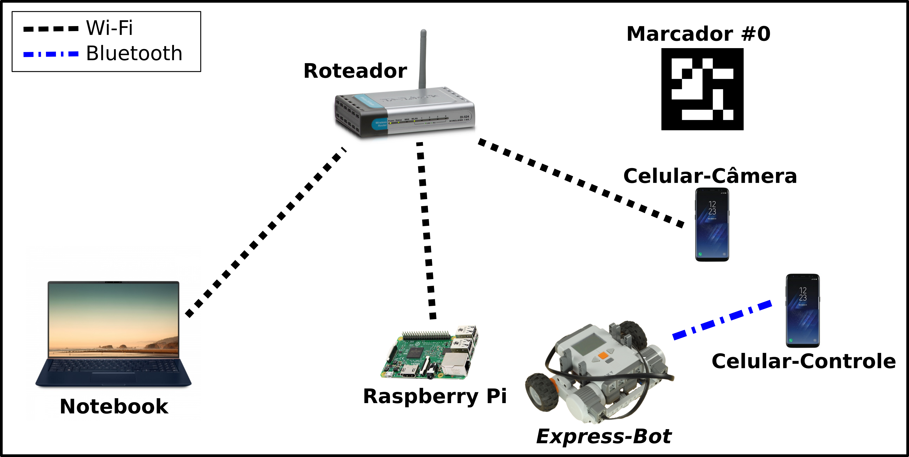

# robot-vls
Indoor robot visual positioning system using fiducial markers.
This project is my bachelor final project in computer engineering at CEFET-MG.

## Paper
To get an indepth view about this project you can check out the paper [here](https://drive.google.com/file/d/1gxH1WYZJRkoX1bB29TYsKaD1EMyXPLdb/view?usp=sharing).

## Field test
You can check out the field test in this [video](https://www.youtube.com/watch?v=fFo7xQlS7mM).

## Setup

Before we dive into how to setup this project it is important to 
understand how this repo is organized. This repo has three main
folders:
* localization_system
* model_creator
* webapp

Those folders are related to the architecture implemented in this 
project (more about that in the paper cited above). The image bellow 
should be used as a reference to understand how those folders are 
related to the project.



**localization_system** contains a project that is going to be running 
in the *Raspberry Pi*. That project is responsible for getting the images
captured by *Celular-Câmera*, identify fiducial markers and then 
send information about markers and its location.

**model_creator** contains code that generate a CNN model and a MLP 
model.

**webapp** contains a web project that is going to be running in the **Notebook** that 
receives info about markers and renders robot 
localization in a 3D environment.

Bellow I am going to explain in more details each folder and its 
role in this project.

### webapp

You should setup this folder in your pc or any server that you're 
going to use to visualize the robot's position. You should have node
version `v12.13.0` or higher and yarn version `1.19.1` or higher.
To check if node or yarn is installed properly and 
its version just write the 
following command in your terminal.

* node
```
$node --version
```

* yarn
```
$yarn --version
```

Next, go to `webapp/` and do the following

* Install all packages needed
```
$yarn install
```

* Run the server
```
$yarn start
```

Now you can open your browser at `localhost:3000` and the server should be running fine.

### localization_system

This folder should be setup in a Raspberry Pi. 

Raspeberr Pi infos:
* Model: Raspberry Pi 3 Model B V1.2
* Micro SSD: SanDisk Ultra 16GB
* OS: Raspbian Buster with desktop | Version February 2020
